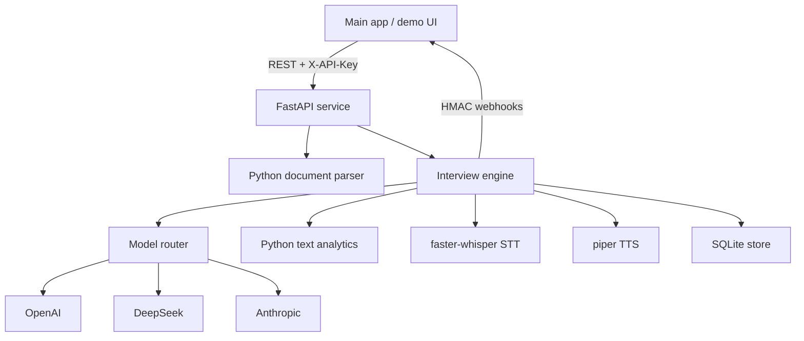

# Voice Interviewer Microservice

A standalone microservice that turns a resume plus a job description into a full voice mock
interview. It generates STAR behavioural questions, records spoken answers, transcribes and
analyses them, then returns a success score with concrete improvement tips.

It is designed to be plugged into an existing main app through a REST API with API-key auth and
webhook callbacks.

## What it does

1. Accepts a resume and a job description as text or as PDF / DOCX / TXT files.
2. Extracts skills, titles, quantified achievements and requirement gaps with pure Python
   (no model calls, no cost).
3. Generates STAR interview questions tailored to the candidate's skill gaps.
4. Asks each question, optionally reading it aloud with local TTS.
5. Records the answer, transcribes it locally with faster-whisper, and computes deterministic text
   metrics (word count, speaking pace, filler words, hedging, STAR coverage, action verbs).
6. Scores the answer and suggests a rewrite, using the LLM only where reasoning is actually needed.
7. Produces a final report: overall score, readiness level, dimension scores, critical gaps,
   a prioritised improvement plan, and a recruiter narrative.
8. Fires webhooks so the main app can react without polling.

## Key design points

- **Cost-aware model router.** Three platforms are tried in a fixed fallback order: OpenAI,
  then DeepSeek, then Anthropic. Simple tasks stay on cheaper models inside that order; complex
  tasks use stronger models. If the preferred provider is down or rate-limited, the router fails
  over to the next provider, with a circuit breaker so a broken provider is not hammered.
- **Python-first.** Parsing, metrics, heuristic scoring, aggregation and fallbacks are implemented
  in Python. LLM calls are reserved for generation and judgement.
- **Local voice stack.** faster-whisper for speech-to-text and piper for text-to-speech, so there
  is no per-minute voice API cost.
- **Graceful degradation.** If a model task fails, the interview continues with heuristic scores
  instead of breaking.

## Architecture



## Project layout

```
backend/
  app/
    main.py                     FastAPI app, error handling, CORS
    config.py                   Environment-driven settings
    api/                        Routes: system, interviews, speech
    llm/router.py               Multi-provider routing, tiers, fallback, circuit breaker
    llm/providers/              OpenAI/DeepSeek (compatible) and Anthropic clients
    prompts/                    Prompt builders for questions, analysis, report
    services/
      document_parser.py        PDF/DOCX extraction + skill/achievement heuristics
      text_analysis.py          Deterministic transcript metrics and heuristic scoring
      interview_service.py      Orchestration of the interview lifecycle
      storage.py                SQLite persistence
      webhook.py                Signed webhook delivery with retries
    voice/                      stt.py and tts.py
    schemas/                    API request/response models
  models.yaml                   Tier definitions, task-to-tier map, pricing
  tests/                        Router, analytics and end-to-end API tests
frontend/                       Vite + React demo UI with in-browser recording
scripts/                        Setup and run helpers
docs/                           Integration and routing guides
```

## Quickstart

### 1. Backend

```bash
# Create the virtualenv, install dependencies and copy .env.example to .env
INSTALL_VOICE=1 ./scripts/setup_backend.sh
```

Add at least one provider key to `backend/.env`. The router tries OpenAI first, then DeepSeek, then Anthropic:

```bash
OPENAI_API_KEY=...
DEEPSEEK_API_KEY=...
ANTHROPIC_API_KEY=...
```

Then start the service:

```bash
./scripts/run_backend.sh
```

API docs are served at `http://localhost:8080/docs`.

### 2. Optional local voice

Speech-to-text and text-to-speech are optional. Without them the API still works and you can submit
typed answers.

```bash
# Install the voice extras (heavier: ctranslate2, onnxruntime)
pip install --break-system-packages -r backend/requirements-voice.txt

# Download a piper voice and point the service at it
mkdir -p backend/data/piper
python -m piper.download_voices en_US-lessac-medium --data-dir backend/data/piper
```

```bash
PIPER_MODEL_PATH=./data/piper/en_US-lessac-medium.onnx
WHISPER_MODEL=base
```

### 3. Demo UI

```bash
cd frontend
npm install
npm run dev
```

Open `http://localhost:5173`. The dev server proxies `/api` to `http://localhost:8080`, and allows
`*.monkeycode-ai.live` hosts for remote previews.

## Configuration

All settings are environment variables; see `backend/.env.example`.

| Variable | Purpose | Default |
| --- | --- | --- |
| `API_KEYS` | Comma-separated accepted API keys | `dev-key-change-me` |
| `DATABASE_PATH` | SQLite database file | `backend/data/interviews.db` |
| `STORAGE_DIR` | Root for audio and artifacts | `backend/data` |
| `MODELS_CONFIG_PATH` | Router tier/task config | `backend/models.yaml` |
| `DEEPSEEK_API_KEY` / `OPENAI_API_KEY` / `ANTHROPIC_API_KEY` | Provider credentials | empty |
| `LLM_TIMEOUT_SECONDS` | Per-request timeout | `60` |
| `PROVIDER_COOLDOWN_SECONDS` | Circuit-breaker cooldown after failures | `90` |
| `WEBHOOK_URL` / `WEBHOOK_SECRET` | Default callback and HMAC secret | empty |
| `WHISPER_MODEL` / `WHISPER_DEVICE` / `WHISPER_COMPUTE_TYPE` | STT tuning | `base` / `cpu` / `int8` |
| `PIPER_BINARY` / `PIPER_MODEL_PATH` | TTS binary and voice model | `piper` / empty |

A provider with no API key is skipped silently by the router.

## API overview

All `/api/v1` routes except `/health` and `/ready` require the `X-API-Key` header.

| Method | Path | Description |
| --- | --- | --- |
| GET | `/api/v1/health` | Liveness |
| GET | `/api/v1/ready` | Readiness, provider and voice status |
| GET | `/api/v1/models` | Router status: providers, tiers, task map, spend |
| POST | `/api/v1/interviews` | Create an interview from JSON text |
| POST | `/api/v1/interviews/upload` | Create an interview from multipart files |
| GET | `/api/v1/interviews` | List interviews |
| GET | `/api/v1/interviews/{id}` | Interview status, questions, skill match |
| GET | `/api/v1/interviews/{id}/questions` | Questions only |
| POST | `/api/v1/interviews/{id}/answers` | Submit a typed answer |
| POST | `/api/v1/interviews/{id}/answers/audio` | Submit a recorded answer (transcribed) |
| GET | `/api/v1/interviews/{id}/transcript` | Full transcript with metrics |
| POST | `/api/v1/interviews/{id}/finish` | Build the final scored report |
| GET | `/api/v1/interviews/{id}/report` | Fetch a stored report |
| GET | `/api/v1/interviews/{id}/events` | Audit trail, including degraded LLM tasks |
| POST | `/api/v1/speech/transcribe` | Standalone transcription |
| POST | `/api/v1/speech/synthesize` | Standalone text-to-speech (WAV) |

### Minimal flow

```bash
# Create the interview
curl -sX POST http://localhost:8080/api/v1/interviews \
  -H 'X-API-Key: dev-key-change-me' -H 'Content-Type: application/json' \
  -d '{"role":"Backend Engineer","resume_text":"Python, FastAPI, PostgreSQL, reduced latency 40%","jd_text":"Requires Python, Kafka, 5+ years"}'

# Submit an answer
curl -sX POST http://localhost:8080/api/v1/interviews/<id>/answers \
  -H 'X-API-Key: dev-key-change-me' -H 'Content-Type: application/json' \
  -d '{"question_index":0,"transcript":"Situation ... Task ... Action ... Result ..."}'

# Finish and get the report
curl -sX POST http://localhost:8080/api/v1/interviews/<id>/finish -H 'X-API-Key: dev-key-change-me'
```

Audio answers accept any browser-recordable format (webm/ogg/wav):

```bash
curl -sX POST http://localhost:8080/api/v1/interviews/<id>/answers/audio \
  -H 'X-API-Key: dev-key-change-me' \
  -F question_index=0 -F duration_seconds=42 -F audio=@answer.webm
```

## Webhooks

Set a per-interview `callback_url` or the global `WEBHOOK_URL`. Events are `interview.created` and
`interview.completed`. Each request carries:

- `X-Interview-Event`: event name
- `X-Interview-Signature`: HMAC-SHA256 of the raw body, using `WEBHOOK_SECRET`

Verify in the main app:

```python
import hashlib, hmac
expected = hmac.new(secret.encode(), raw_body, hashlib.sha256).hexdigest()
assert hmac.compare_digest(expected, request.headers["X-Interview-Signature"])
```

See `docs/INTEGRATION.md` for full Python, Node and webhook examples.

## Model routing

Tiers, task mapping and pricing live in `backend/models.yaml`. See `docs/MODEL_ROUTING.md`.

Task-to-tier defaults:

| Task | Tier | Why |
| --- | --- | --- |
| `resume_summary`, `jd_metadata`, `followup_generation`, `answer_coaching` | cheap | Short, low-reasoning output |
| `question_generation`, `answer_analysis`, `tips_generation` | standard | Structured generation with real judgement |
| `final_scoring`, `report_narrative` | premium | High-stakes evaluation |

Provider health is exposed at `GET /api/v1/models`, including per-provider availability and
cumulative estimated spend, so the main app can monitor cost.

## Tests

```bash
cd backend
python -m pytest -q
```

The suite uses a fake router, so it runs without API keys or network access.

## Cost strategy

To keep running costs low:

- Resume and JD parsing, metrics and heuristic scoring are pure Python.
- Cheap-tier models handle short follow-ups, tagging and coaching hints.
- Fallback order is OpenAI, then DeepSeek, then Anthropic, so a cheaper or stronger later candidate is not preferred over a configured OpenAI key.
- Premium models are used only for final scoring and the recruiter narrative.
- Per-answer LLM analysis can be disabled with `config.analyze_per_answer = false`, which leaves
  Python heuristics in place.
- If providers fail, the report falls back to a fully deterministic scorecard rather than retrying
  endlessly.
